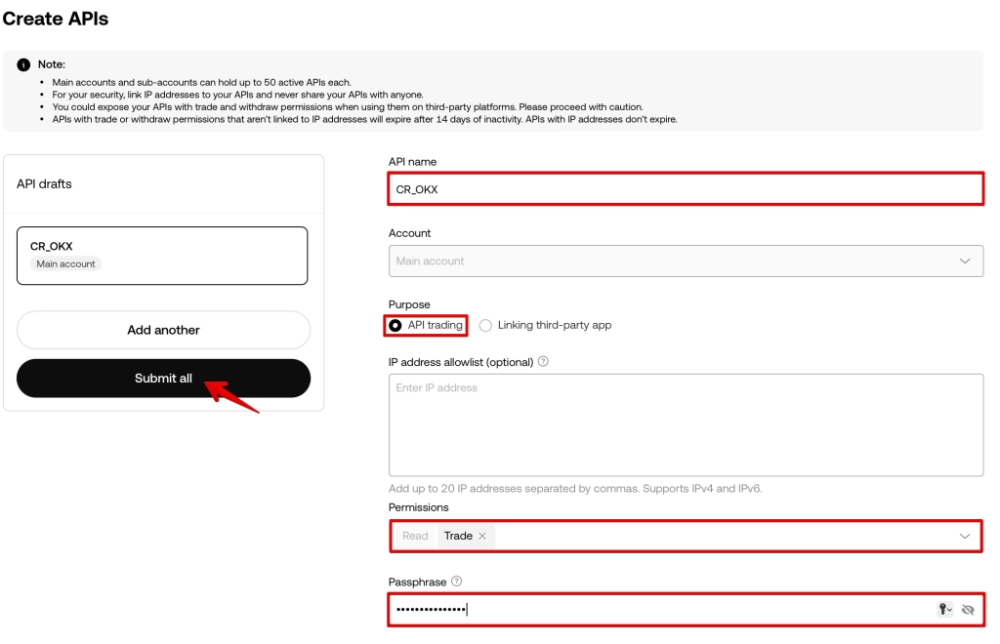

# How to Create API Keys for OKX – Complete Integration Guide

Setting up API keys on OKX might sound technical, but it's actually pretty straightforward. Whether you're connecting to a trading terminal or automating your crypto strategy, getting your OKX API keys configured correctly is the first step. This guide walks you through the entire process—from generating your keys on the exchange to successfully integrating them with your trading platform. You'll learn exactly which permissions to enable, how to secure your passphrase, and what to do after your keys are created.

---

To integrate OKX exchange with your trading terminal, you'll need to generate an API key. Here's how to do it step by step.

Head over to the OKX website and log into your account. Click your profile icon in the upper right corner, then select the **API keys** option from the dropdown menu.

Once you're in the API management section, click the **Create APIs** button to start the process.

## Configuring Your API Key Settings

A form will appear asking you to fill in several important fields:

- **API name** — Give your key a memorable name so you can identify it later
- **Purpose** — Select "API trading" from the options
- **Permissions** — Enable trading permissions by checking the Trade box
- **Passphrase** — Create a secure passphrase between 6-32 characters (you'll need this later for integration, so save it somewhere safe)

After filling everything out, click **Submit all** to proceed.

The system will ask you to confirm the operation using whatever authentication methods you have connected to your account—this might be email verification, SMS, or authenticator app.

## Saving Your API Credentials

Once confirmed, you'll see your API information displayed. **This is important**: copy the API Key, Secret Key, and remember your passphrase. Store them somewhere secure—you won't be able to see the Secret Key again after closing this window.

After copying everything, confirm the creation in the popup window.

Your newly created key will now appear in a table below. You can click **View** anytime to access the key information you need for integration (though remember, the Secret Key is only shown once during creation).

## Connecting Your API to Your Trading Platform

Now that you have your API credentials, it's time to connect them to your trading platform. Open your platform and navigate to **Account** → **Exchange accounts** section, then click **Add new exchange**.

A form will appear where you'll enter your credentials:

- Select OKX from the exchange list
- Enter your API Key
- Enter your Secret Key  
- Enter the passphrase you created earlier
- Give this connection a name for easy reference

Once everything is filled in, click **Add new exchange**. 

After a few seconds, the integration completes and your OKX account appears in the connected exchanges section. 👉 [Ready to start trading with seamless API integration? Join OKX now](https://www.okx.com/join/47044926)

## Moving Funds to Your Trading Account

Here's something that trips up newcomers: when you first transfer funds to OKX, they land in your Funding Account. To actually trade, you need to move them to your Trading Account.

Click the **Transfer** button to open the transfer window.

Select the amount you want to move, confirm the transfer, and you're all set. Your funds are now ready for trading.

---

Creating API keys on OKX takes just a few minutes, but getting it right matters. You've now generated your keys with the correct trading permissions, secured your credentials, and successfully integrated them with your trading platform. Remember to keep your Secret Key and passphrase stored safely—losing them means you'll need to generate new keys. With everything properly configured, you can now execute trades programmatically and take advantage of automated trading strategies. For anyone looking to connect multiple tools or platforms to their exchange account, OKX's API system offers the flexibility and security you need (set up your account at: https://www.okx.com/join/47044926).
